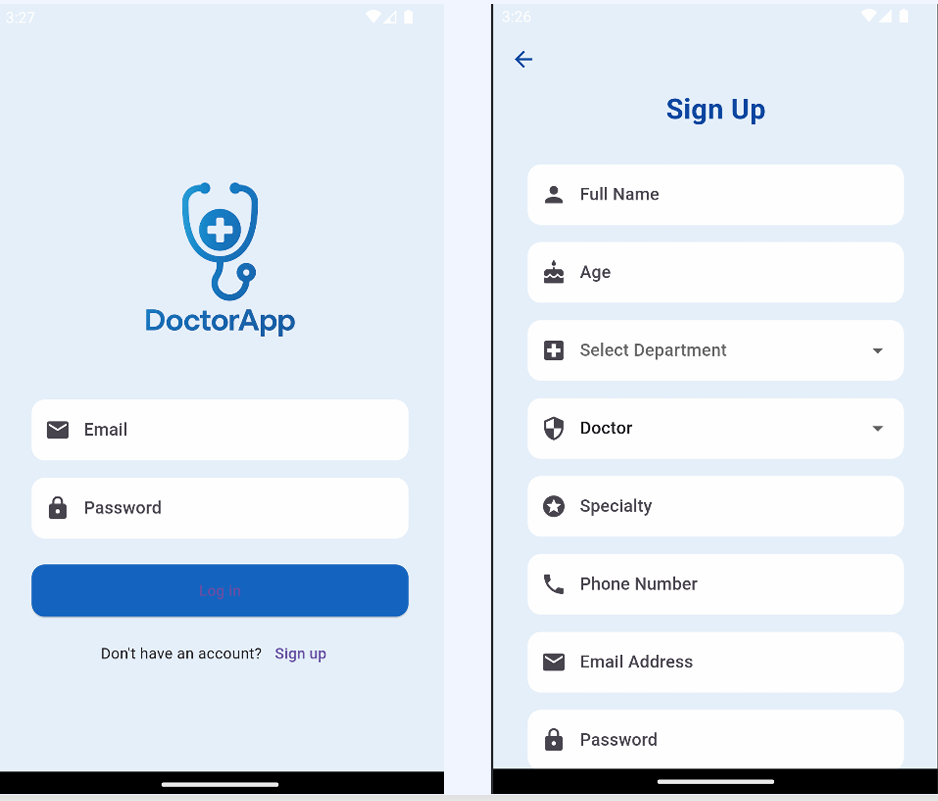
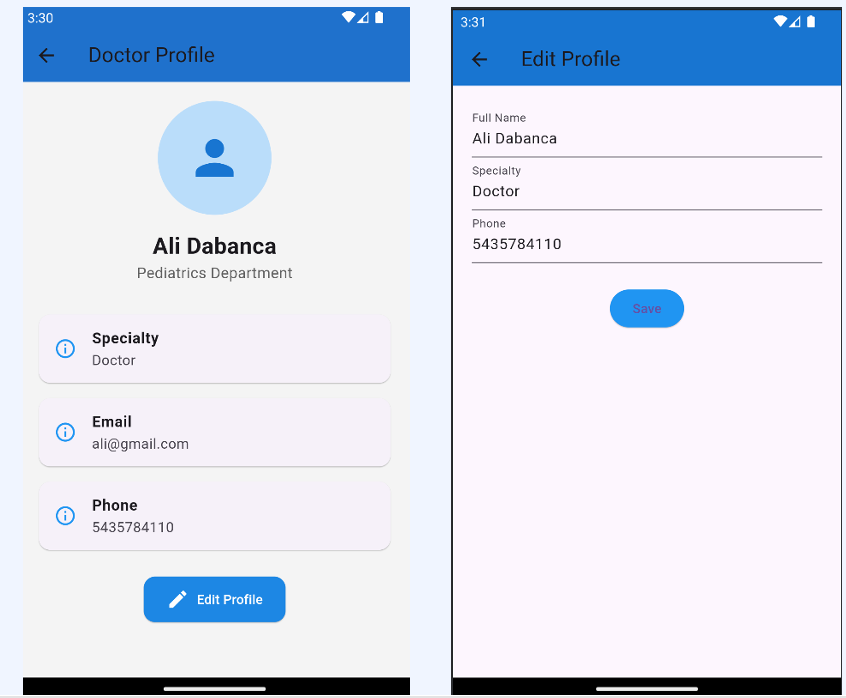
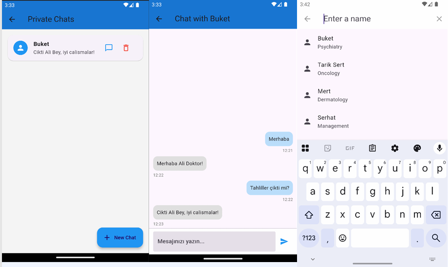
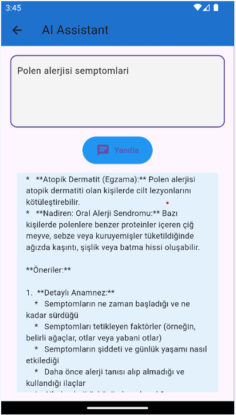

DoctorApp - Sağlık Çalışanları İçin Mobil İletişim Platformu

DoctorApp, doktorlar ve sağlık yöneticileri arasındaki iletişimi hızlandırmak, bilgi paylaşımındaki gecikmeleri azaltmak ve kişisel ajanda yönetimini kolaylaştırmak amacıyla geliştirilmiş, Flutter tabanlı bir mobil uygulamadır .

 Özellikler

Hızlı ve Güvenli Mesajlaşma: Doktorlar arası birebir veya departman bazlı grup sohbetleri .

Kişisel Ajanda Yönetimi: Randevuları görüntüleme, ekleme ve tamamlandı olarak işaretleme.

Yapay Zeka Destekli Tıbbi Asistan: Gemini API entegrasyonu ile semptom analizi ve öneri desteği.

Rol Tabanlı Erişim: Doktor ve Admin rolleri için özelleşmiş yetkilendirme ve arayüzler.

Departman Yönetimi: Bölüm bazlı gezinme ve iletişim kanalları.

 Teknik Araçlar ve Teknolojiler

Frontend: Flutter - Cross-platform mobil uygulama geliştirme.

Backend / Database: Firebase (Cloud Firestore, Authentication, Storage) 

Yapay Zeka: Gemini API.

Versiyon Kontrol: GitHub.

Tasarım: Draw.io (UML ve veritabanı şemaları için).

 Mimari ve Yöntemler

Modüler UI Tasarımı: Bileşen tabanlı Flutter widget'ları.

Durum Yönetimi: Stateful Widget ve minimal state lifting yaklaşımı.

Gerçek Zamanlı Veri: Canlı sohbetler için StreamBuilder kullanımı.

Güvenlik: Firestore güvenlik kuralları ve kimlik doğrulama kontrolleri.

Uygulama Ekran Görüntüleri
Aşağıdaki görseller uygulamanın temel akışını ve arayüzünü temsil etmektedir:

1. Giriş ve Kayıt Ekranları  

2. Kullanıcı Ana Sayfaları - Doktor & Admin  

3. Profil ve Düzenleme Sayfası  

4. Randevu ve Ajanda Yönetimi  

5. Departman Sohbet Arayüzü 

6. Özel Sohbet Arayüzü 

7. Gemini AI Tıbbi Asistan  

8. Admin Paneli 

9. Departman Listesi 

